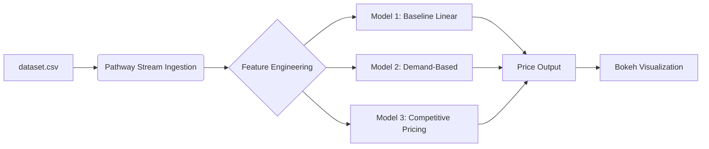

# FINAL-CAPSTONE-PROJECT

# Real‑Time Dynamic Pricing System for Urban Parking Spaces

A streaming‑powered solution that dynamically adjusts parking rates for 14 urban spaces, optimizing utilization and revenue with real‑time visualizations and competitive pricing intelligence.
---

## Table of Contents

1. [Project Overview](#project-overview)  
2. [Features](#features)  
3. [Tech Stack](#tech-stack)  
4. [Architecture](#architecture)
5. [Data Ingestion and Processing](#data-ingestion-and-processing)
6. [Feature Engineering](#feature-engineering)
7. [Pricing Logic](#pricing-logic)  
   - [Model 1: Baseline Linear Model](#model-1-baseline-linear-model)  
   - [Model 2: Demand-Based Price Function](#model-2-demand-based-price-function)  
   - [Model 3: Competitive Pricing Model](#model-3-competitive-pricing-model)  
   
8. [Real-Time Prediction and Visualization](#real-time-prediction-and-visualization)
9.  [Getting Started](#getting-started)
   - [Prerequisites](#prerequisites)  
   - [Installation](#installation)  
   - [Usage](#usage)
     
7. [Submission Packaging](#submission-packaging)
8. [Live Visualization](#live-visualization)
9. [Final Checklist](#final-checklist)
    


## Project Overview

This project implements a real-time dynamic pricing system for 14 urban parking spaces. The system leverages streaming data to adjust parking rates based on a three-tiered logic 
system, aiming to optimize utilization and revenue. The solution is designed to be interactive, reproducible, and visually explainable.
---

## Features

 • Real-Time Stream Simulation: Utilizes Pathway to simulate delayed, timestamped 
data ingestion from dataset.csv .

 • Tiered Pricing Models: Implements three models of increasing complexity:
 
 • Model 1 (Baseline Linear): A simple linear price adjustment based on occupancy.
 
 • Model 2 (Demand-Based): Calculates demand using multiple features (occupancy, queue length, traffic, special day, vehicle type) and adjusts prices accordingly.
 
 • Model 3 (Competitive Pricing): A geo-aware model that considers nearby parking lot prices and loads, suggesting rerouting or adjusting prices for competitive advantage.
 
 • Live Visualization: Provides real-time interactive plots using Bokeh, including price comparisons with competitors and optional rerouting decision annotations.
 
 • Smooth Pricing Adjustments: Ensures prices remain within a realistic range (0.5x to 2x base price) and uses smoothing methods for stable adjustments.
 
 • Submission-Ready Output: Includes detailed documentation, architecture diagrams, and snapshot export logic for reports.


---

## Tech Stack

• Python: Core programming language.

• NumPy: For numerical operations and mathematical computations.

• Pandas: For data manipulation and analysis.

• Pathway: For building real-time data pipelines and processing streaming data.

• Bokeh: For creating interactive, real-time data visualizations.

• Google Colab: The primary execution environment for the project

---

## Architecture




 ## Data Ingestion and Processing

- **Source:** `dataset.csv` (timestamped events: vehicle arrivals/departures, competitor price feeds, special‑day flags)  
- **Streaming Framework:** Pathway  
- **Key Features:**
  - Handles out‑of‑order and delayed messages  
  - Ensures correct temporal ordering  

```python
# Example Pathway ingestion snippet

 import pathway as pw
 import pandas as pd

 # Simulate data stream from dataset.csv
 def stream_data_from_csv(filepath):
 df = pd.read_csv(filepath)

 # Simulate delayed, timestamped data ingestion
 # This part will be handled by Pathway's specific functions
 # Example: pw.io.csv.read(filepath, mode="streaming", 
autocommit_duration_ms=100)

 pass # Placeholder for actual Pathway stream setup

# Example of how Pathway might ingest and process data

 # input_table = pw.io.csv.read("dataset.csv", mode="streaming", 
autocommit_duration_ms=100)
 # This will be integrated into the sample notebook

```


## Feature Engineering
As each event arrives, we compute:

Occupancy: Current number of parked vehicles

Queue Length: Vehicles waiting at entrance

Traffic Level: Nearby congestion metric

Special Day Indicator: 1 if holiday/event, else 0

Vehicle Type Weight:

Car → 1.0

Bike → 0.5

Truck → 1.5

```python
# Pseudocode for feature extraction

features = stream.map(lambda e: {
    "occupancy": e.current_occupancy,
    "queue_length": e.queue_length,
    "traffic": e.traffic_index,
    "is_special": int(e.date in special_days),
    "type_weight": vehicle_weights[e.type],
})
```

## Pricing Logic
 
The core of the system is the three-tiered pricing logic, implemented within Pathway's data 
processing pipeline:

 ## Model 1: Baseline Linear Model
 
 This model serves as a foundational reference point. The price for the next time step ( Price(t+1) ) is a linear function of the current price (Price(t) ) and the occupancy rate:
 Price(t+1) = Price(t) + α * (Occupancy / Capacity)

 
```python
 def calculate_price_model1(current_price, occupancy, capacity, alpha=0.5):
 return current_price + alpha * (occupancy / capacity)

 # Integration with Pathway (example)
 # prices_model1 = input_table.with_columns(
 #     price_t_plus_1 = pw.this.price_t + 0.5 * (pw.this.occupancy / 
pw.this.capacity)
 # )
```

 ## Model 2: Demand-Based Price Function
 
 This more advanced model calculates a Demand value based on multiple factors and then adjusts the price. The demand function is defined as:
 Demand = α·(Occupancy/Capacity) + β·QueueLength ‒ γ·Traffic + δ·IsSpecialDay + ε·VehicleTypeWeight
 
 This Demand value is then normalized, and the price is adjusted from a base price of $10:
 Price = $10 × (1 + λ × NormalizedDemand)
 Prices are smoothed and bounded to ensure they remain between 0.5x and 2x the base 
price, preventing erratic fluctuations.

```python
import numpy as np
 def calculate_demand(occupancy, capacity, queue_length, traffic, 
is_special_day, vehicle_type_weight,
 alpha=0.7, beta=0.3, gamma=0.2, delta=0.5, epsilon=0.4):

 # Normalize occupancy/capacity if needed

 normalized_occupancy_rate = occupancy / capacity
 demand = (alpha * normalized_occupancy_rate) + \
 (beta * queue_length) - \
 (gamma * traffic) + \
 (delta * is_special_day) + \
 (epsilon * vehicle_type_weight)
 return demand

 def normalize_demand(demand, min_demand, max_demand):

 # Simple min-max normalization
 return (demand - min_demand) / (max_demand - min_demand) if (max_demand - 
min_demand) != 0 else 0

def calculate_price_model2(base_price, normalized_demand, lambda_val=0.5):
    price = base_price * (1 + lambda_val * normalized_demand)
    # Apply smoothing and bounds (0.5x to 2x base price)
    min_bound = base_price * 0.5
    max_bound = base_price * 2.0
    return max(min_bound, min(max_bound, price))

 # Integration with Pathway (example)
 # prices_model2 = input_table.with_columns(
 #     demand = calculate_demand(pw.this.occupancy, pw.this.capacity, ...),
 #     normalized_demand = normalize_demand(pw.this.demand, min_val, max_val), 
# min_val, max_val need to be determined dynamically or pre-defined
 #     price_model2 = calculate_price_model2(10, pw.this.normalized_demand)
 # )
```

 
 ## Model 3: Competitive Pricing Model
 
 This model introduces location intelligence and competitive awareness. It utilizes geographic proximity (calculated using Haversine distance) to nearby parking spaces and their prices. The logic includes:

 • Rerouting Logic: If the current parking lot is near full (e.g., occupancy ≥ 95%) and 
nearby lots are cheaper, the system may suggest rerouting vehicles or reduce the current lot's price.

 • Price Optimization: If nearby lots are more expensive, the current lot's price can be increased while remaining competitive and attractive.

```python
from math import radians, sin, cos, sqrt, atan2
 def haversine_distance(lat1, lon1, lat2, lon2):
    R = 6371  # Radius of Earth in kilometers
    lat1, lon1, lat2, lon2 = map(radians, [lat1, lon1, lat2, lon2])
    dlon = lon2 - lon1
    dlat = lat2 - lat1
    a = sin(dlat / 2)**2 + cos(lat1) * cos(lat2) * sin(dlon / 2)**2
    c = 2 * atan2(sqrt(a), sqrt(1 - a))
    distance = R * c
    return distance

 def apply_competitive_logic(current_price, current_occupancy, 
nearby_lot_prices, nearby_lot_occupancies, base_price=10):

    # Simplified logic for demonstration
    # Thresholds for rerouting/price adjustment
    OCCUPANCY_THRESHOLD = 0.95 # 95%
    PRICE_DIFFERENCE_THRESHOLD = 0.1 # 10% cheaper
    if current_occupancy / 1.0 > OCCUPANCY_THRESHOLD: # Assuming capacity is 
1.0 for simplicity, replace with actual capacity
        for nearby_price in nearby_lot_prices:
            if nearby_price < current_price * (1 - 
PRICE_DIFFERENCE_THRESHOLD):
                # Suggest rerouting or reduce current price
return current_price * 0.9 # Example: 10% price reduction

 # If nearby lots are expensive, potentially increase price
 # This logic would be more complex, considering average nearby prices 
etc.
 # For now, just return current price if no rerouting/reduction needed
 return current_price
 # Integration with Pathway (example would involve joining streams for nearby 
lots)
 # prices_model3 = input_table.with_columns(
 #     # Logic to find nearby lots and their prices/occupancies
 #     # Then apply apply_competitive_logic
 # )
```

---

## Real-Time Prediction and Visualization

Prices are continuously updated with incoming streamed data. Bokeh is used to visualize 
these predictions in real-time, providing:
 • Line plots showing real-time pricing for each parking space.
 
 • Comparisons between the system's prices and competitor prices.
 
 • Optional annotations for rerouting decisions

```python
 bokeh serve --show notebooks/real_time_dashboard.ipynb
```

```python
from bokeh.plotting import figure, show
 from bokeh.models import ColumnDataSource
 from bokeh.io import output_notebook

 # output_notebook() # Call this in Colab to render plots inline

 def create_realtime_plot(data_source, title="Parking Price Over Time", 
y_axis_label="Price ($)"):
 p = figure(x_axis_type="datetime", title=title, height=300, width=800)
 p.line(x='timestamp', y='price', source=data_source, legend_label="My 
Price", line_width=2)

 # Add competitor prices if available
 # p.line(x='timestamp', y='competitor_price', source=data_source, 
legend_label="Competitor Price", color='red', line_width=2)
 p.xaxis.axis_label = "Time"
 p.yaxis.axis_label = y_axis_label
 p.legend.location = "top_left"
 return p

 # Example usage with Pathway (requires Pathway's Bokeh integration)
 # source = ColumnDataSource(data=dict(timestamp=[], price=[]))
 # # Pathway would update this source in real-time
 # # For example: input_table.map(lambda row: source.stream({'timestamp': 
[row.timestamp], 'price': [row.price]}))
 # p = create_realtime_plot(source)
 # show(p)

```


## Getting Started

### Prerequisites

* Google Colab 
* Access to the provided `dataset.csv` and `Sample_Notebook.ipynb`
  
### Installation

 No specific installation steps are required beyond what is typically available in a Google Colab environment. Ensure numpy , pandas , pathway , and If not, they can be installed using bokeh libraries are installed. pip within the Colab notebook:

```
pip install numpy pandas pathway bokeh panel
```

### Usage

 1. Upload dataset.csv and Sample_Notebook.ipynb to your Google Colab environment.
 2. Open Sample_Notebook.ipynb in Google Colab.
 3. Run the cells sequentially. The notebook contains:
    
 • Data simulation code using Pathway.
 
 • Hooks for inserting the pricing logic for Model 1, Model 2, and Model 3.
 
 • Code for real-time Bokeh visualizations.

---


## Submission Packaging

 The final submission will be a well-commented Google Colab notebook (Sample_Notebook.ipynb ) containing all the code for data simulation, feature engineering, 
pricing models, and real-time visualizations.

 Snapshot Export Logic
 
 For reporting purposes, Bokeh plots can be exported as static images (PNG) or HTML 
embeds. This allows for inclusion in a final report or presentation.

```python
 # Example for exporting Bokeh plots
 # from bokeh.io import export_png, export_html
 # # To export as PNG (requires selenium and geckodriver/chromedriver)
 # # export_png(p, filename="parking_price_plot.png")
 # # To export as HTML embed
 # # export_html(p, filename="parking_price_plot.html")
```


---

## Live Visualization

Access the live Bokeh dashboard in Colab with Panel:

```
pn.Column(viz).servable()
pw.run()
```

---

## Final Checklist

* [ ] Reproducibility: Notebook runs end-to-end without errors.
* [ ] Clarity: Code comments and README explanations are concise.
* [ ] Stability: Streaming pipeline runs smoothly.
* [ ] Visual Explainability: Bokeh plots clearly show pricing dynamics.
